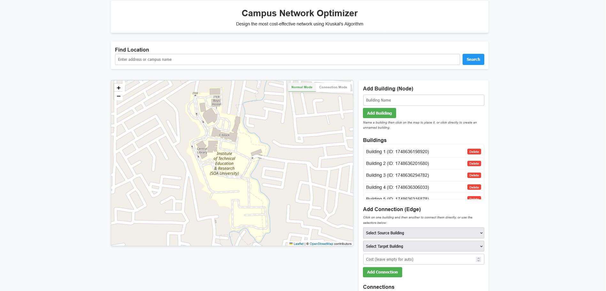

# Campus Network Optimizer



> An interactive tool for designing and optimizing campus network infrastructure using Kruskal's Algorithm to find the minimum spanning tree.

[](https://opensource.org/licenses/MIT)
[](https://github.com/srivtx/campus-network-optimizer)
[](https://www.ecma-international.org/ecma-262/6.0/)
[](https://leafletjs.com/)

## 📋 Overview

Campus Network Optimizer is an educational tool that demonstrates network optimization using real-world maps. Design campus networks by placing buildings on a map and connecting them, then use Kruskal's algorithm to find the most cost-effective way to connect all buildings while minimizing total cable length or cost.

Created by [Sribatsha Dash](https://github.com/srivtx), this project demonstrates principles of graph theory, minimum spanning trees, and network design in an interactive and visual way.

## ✨ Features

- **Interactive Map Interface**: Place buildings directly on real-world maps
- **Mouse-Based Building Connection**: Click on two buildings to create direct connections
- **Real-Time Distance Calculation**: Automatically calculates distances between buildings
- **Network Optimization**: Implements Kruskal's Algorithm to find the minimum spanning tree
- **Drag & Drop Buildings**: Reposition buildings by dragging them
- **Location Search**: Find any campus worldwide using OpenStreetMap geocoding
- **Import/Export Data**: Save and load your network designs
- **Sample Data Set**: Includes a ready-made Columbia University campus example
- **Visual Optimization Results**: Highlights the optimal network connections

## 🖼️ Screenshots


*The main interface showing a sample campus network*


*Creating connections between buildings using the mouse*


*The optimized network after running Kruskal's algorithm*

## 🚀 Getting Started

### Prerequisites

- Modern web browser (Chrome, Firefox, Edge, Safari)
- For the backend server (optional): Node.js and npm

### Installation

1. **Clone the repository**
   ```bash
   git clone https://github.com/srivtx/campus-network-optimizer.git
   cd campus-network-optimizer
